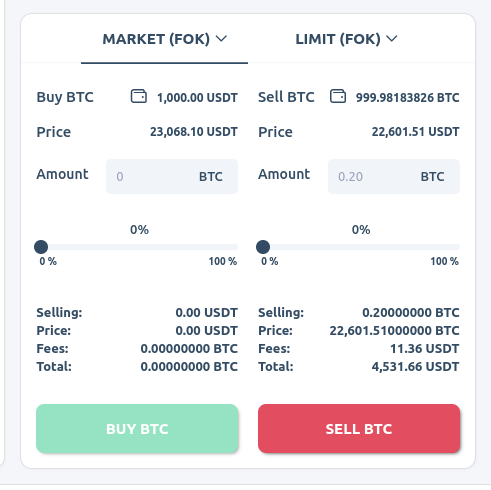

# Shift-GraphQl-Queries
Document with examples of often used graphql requests

# Table of Contents
 
 1. **[Get Started](#get-started)**
 
 2. **[Guide to Exchange Page](#guide-to-exchange-page)**
 
     - [Instrument price bar](#instrument-price-bar) 
     - [Instrument price chart](#instrument-price-chart)
     - [Instruments panel](#instruments-panel)
     - **[Order panel](#order-panel)**
     - [Estimate order](#estimate-order)
     - [Complete order](#complete-order)
     - [Balances panel](#balances-panel)
     - [Generate deposit address](#generate-deposit-address)
     - [Orderbook panel](#orderbook-panel)
 
 3. **[Guide to Markets Page](#guide-to-markets-page)**
     
     - [Estimate conversion](#estimate-conversion)
     - [Complete conversion](#complete-conversion)
 
 4. **[Common Questions](#common-questions)**
    
    - **For admins and traders**
        - [How to get my current permissions?](#3-question-how-to-get-my-current-permissions)
        - [How to create admin API key to be used for server calls?](#4-question-how-to-create-admin-api-key-to-be-used-for-server-calls)
        - [How to get all open orders for user account?](#6-question-how-to-get-all-open-orders-for-user-account)
        - [How to count estimate order price?](#8-question-how-to-count-estimate-order-price)
        - [How to calculate and return fee for current user, payment type and currency?](#9-question-how-to-calculate-and-return-fee-for-current-user-payment-type-and-currency)
        - [How to get the profile data for certain user?](#14-question-how-to-get-the-profile-data-for-certain-user)
        - [How to get deposit address details for crypto deposits?](#15-question-how-to-get-deposit-address-details-for-crypto-deposits)                  
         
    - **For admins only**
        - [How to get list of instruments on exchange?](#1-question-how-to-get-list-of-instruments-on-exchange)
        - [How to create a new instrument?](#2-question-how-to-create-a-new-instrument)
        - [How to create transaction for user account?](#5-question-how-to-create-transaction-for-user-account)
        - [How to verify two-factor authentication token?](#7-question-how-to-verify-two-factor-authentication-token)
        - [How to get information about all available fee groups?](#10-question-how-to-get-information-about-all-available-fee-groups)
        - [How to create new fee group?](#11-question-how-to-create-new-fee-group)
        - [How to update fee group and assign beneficiary user?](#12-question-how-to-update-fee-group-and-assign-beneficiary-user)
        - [How to delete fee group?](#13-question-how-to-delete-fee-group)
        - [How to add new currency to the platform?](#16-question-how-to-add-new-currency-to-the-platform)
        - [How to create user](#17-question-how-to-create-user)
  
 5. **[Fees & Limits structure](#fees-and-limits-structure)**

## Get started

Playground: https://vakotrade.cryptosrvc-dev.com/graphql

In order to quickly get started we have special demo environment where you can play around. JWT tokens generated after following mutations live very long time. So, you can reuse them not worring on expiration time. 

#### Get trader JWT token

You can use any username, if it does not exist trader account will be created. Additionally, all newly created traders automatically get bonus of 1000 of every coins on accounts. So, you can immediately start trading. 

```graphql
mutation {
  trader_demo_signin(username:"test.trader@domain.com") {
    jwt
    expires_at
  }
}
```

#### Get demo admin JWT token
You can use any username, if it does not exist admin account will be created. Admins created this way get all possible permissions on exchange. This is essentially superadmins. 


```graphql 
mutation {
  admin_demo_signin(username:"test.admin@domain.com") {
    jwt
    expires_at
  }
}
```
[back to the top &#11023;](#table-of-contents)

## Guide to Exchange Page


### Instrument price bar


#### Query:

```graphql
query(
  $instrument_id: String!
  $limit: Int
  $date_range: DateRangeInput
  $periodicity: InstrumentHistoryPeriodicity
) {
  instrument_price_bars(
    instrument_id: $instrument_id
    limit: $limit
    date_range: $date_range
    periodicity: $periodicity
  ) {
    instrument_id
    high
    low
    ts
    close
    open
  }
}
```

#### Variables:

```json
{
  "instrument_id": "BTCUSDC",
  "limit": 400,
  "date_range": {
    "time_from": "2023-02-05T16:46:21.000Z",
    "time_to": "2023-02-08T20:01:21.000Z"
  },
  "periodicity": "minute15"
}
```

#### Response:

```json
{
  "data": {
    "instrument_price_bars": [
      {
        "instrument_id": "BTCUSDC",
        "high": 22873.94,
        "low": 22856.7,
        "ts": "2023-02-08 20:00:00",
        "close": 22859.65,
        "open": 22873.94
      },
      {
        "instrument_id": "BTCUSDC",
        "high": 22857.95,
        "low": 22847.17,
        "ts": "2023-02-08 19:45:00",
        "close": 22853.78,
        "open": 22856.75
      },
      {
        "instrument_id": "BTCUSDC",
        "high": 22860.81,
        "low": 22854.21,
        "ts": "2023-02-08 19:30:00",
        "close": 22860.12,
        "open": 22857.8
      }
    ]
  }
}
```
[back to the top &#11023;](#table-of-contents)

### Instrument price chart


#### Query:

```graphql
query(
  $instrument_id: String!
  $limit: Int
  $date_range: DateRangeInput
  $periodicity: InstrumentHistoryPeriodicity
) {
  instrument_price_bars(
    instrument_id: $instrument_id
    limit: $limit
    date_range: $date_range
    periodicity: $periodicity
  ) {
    instrument_id
    high
    low
    ts
    close
    open
  }
}

```

#### Variables:

```json
{
  "instrument_id": "LTCETH",
  "limit": 400,
  "date_range": {
    "time_from": "2023-02-07T18:46:06.000Z",
    "time_to": "2023-02-08T20:11:06.000Z"
  },
  "periodicity": "minute5"
}
```

#### Response:

```json
{
  "data": {
    "instrument_price_bars": [
      {
        "instrument_id": "LTCETH",
        "high": 0.059946,
        "low": 0.059941,
        "ts": "2023-02-08 20:10:00",
        "close": 0.059946,
        "open": 0.059941
      },
      {
        "instrument_id": "LTCETH",
        "high": 0.059946,
        "low": 0.05983,
        "ts": "2023-02-08 20:05:00",
        "close": 0.059885,
        "open": 0.059911
      },
      {
        "instrument_id": "LTCETH",
        "high": 0.060046,
        "low": 0.060006,
        "ts": "2023-02-08 20:00:00",
        "close": 0.060006,
        "open": 0.060046
      }
    ]
  }
}
```
[back to the top &#11023;](#table-of-contents)

### Instruments panel


#### Query:

```graphql
query(
  $periodicity: InstrumentHistoryPeriodicity!
  $limit: Int
  $is_active: ToggleSwitch
) {
  instruments(is_active: $is_active) {
    name
    instrument_id
    base_currency_id
    quote_currency_id
    price_decimals
    min_quantity
    max_quantity
    min_quote_quantity
    max_quote_quantity
    quote_currency {
      precision
    }
    base_currency {
      precision
    }
    price {
      instrument_id
      ask
      bid
      price_24h_change
      ts
    }
    price_bars(limit: $limit, periodicity: $periodicity) {
      instrument_id
      high
      low
      ts
      close
      open
    }
    trading_fees {
      instrument_id
      maker_progressive
      taker_progressive
      maker_flat
      taker_flat
    }
    recent_price_bar(periodicity: $periodicity) {
      instrument_id
      high
      low
      ts
      close
      open
    }
  }
}
```

#### Variables:

```json
{
  "periodicity": "hour",
  "limit": 24
}
```

#### Response:

```json
{
  "data": {
    "instruments": [
      {
        "name": "AVAXBTC",
        "instrument_id": "AVAXBTC",
        "base_currency_id": "AVAX",
        "quote_currency_id": "BTC",
        "price_decimals": 8,
        "min_quantity": 1,
        "max_quantity": 40000,
        "min_quote_quantity": 0.000001,
        "max_quote_quantity": 10,
        "quote_currency": {
          "precision": 8
        },
        "base_currency": {
          "precision": 8
        },
        "price": {
          "instrument_id": "AVAXBTC",
          "ask": 0.00088588,
          "bid": 0.00086743,
          "price_24h_change": -2.46,
          "ts": "2023-02-09 00:32:39"
        },
        "price_bars": [
          {
            "instrument_id": "AVAXBTC",
            "high": 20000,
            "low": 0.00087195,
            "ts": "2023-02-09 00:00:00",
            "close": 0.00087666,
            "open": 0.00087579
          },
          {
            "instrument_id": "AVAXBTC",
            "high": 0.00087784,
            "low": 0.0008717,
            "ts": "2023-02-08 23:00:00",
            "close": 0.00087572,
            "open": 0.000873
          },
          {
            "instrument_id": "AVAXBTC",
            "high": 0.00087524,
            "low": 0.00087193,
            "ts": "2023-02-08 22:00:00",
            "close": 0.00087296,
            "open": 0.00087345
          }
        ],
        "trading_fees": {
          "instrument_id": "ETHUSDT",
          "maker_progressive": 0.01,
          "taker_progressive": 0.01,
          "maker_flat": 0,
          "taker_flat": 0
        },
        "recent_price_bar": {
          "instrument_id": "ETHUSDT",
          "high": 34545,
          "low": 1645.8,
          "ts": "2023-02-09 00:00:00",
          "close": 1652.63,
          "open": 1650.46
        }
      }
    ]
  }
}
```
[back to the top &#11023;](#table-of-contents)

### Order panel



#### Estimate order


#### Query:

```graphql
query(
  $source_currency_id: String!
  $target_currency_id: String!
  $price: Float
  $target_currency_amount: Float
  $source_currency_amount: Float
) {
  estimate_order(
    source_currency_id: $source_currency_id
    target_currency_id: $target_currency_id
    price: $price
    target_currency_amount: $target_currency_amount
    source_currency_amount: $source_currency_amount
  ) {
    type
    price
    quantity
    side
    quantity_mode
    instrument {
      instrument_id
    }
    fees {
      currency_id
      amount
    }
  }
}
```

#### Variables:

```json
{
  "source_currency_id": "BTC",
  "target_currency_id": "ETH",
  "price": null,
  "target_currency_amount": 2202.1484291
}
```

#### Response:

```json
{
  "data": {
    "estimate_order": {
      "type": "market",
      "price": 0.072716,
      "quantity": 2202.1484291,
      "side": "buy",
      "quantity_mode": "base",
      "instrument": {
        "instrument_id": "ETHBTC"
      },
      "fees": [
        {
          "currency_id": "ETH",
          "amount": 22.021484291
        }
      ]
    }
  }
}
```
[back to the top &#11023;](#table-of-contents)

#### Complete order


    
#### Query:

```graphql
mutation(
  $instrument_id: String!
  $type: OrderType!
  $price: Float
  $side: OrderSide!
  $time_in_force: OrderTimeInForce!
  $quantity: Float!
  $expires_at: String
  $quantity_mode: OrderQuantityMode
) {
  create_order(
    instrument_id: $instrument_id
    type: $type
    price: $price
    side: $side
    time_in_force: $time_in_force
    quantity: $quantity
    expires_at: $expires_at
    quantity_mode: $quantity_mode
  ) {
    order_id
    type
    side
    status
    price
    quantity
    executed_quantity
    remaining_quantity
    quantity_mode
    instrument_id
    message
    updated_at
    created_at
    expires_at
  }
}
```

#### Variables:

```json
{
  "instrument_id": "ETHBTC",
  "type": "market",
  "price": null,
  "side": "sell",
  "time_in_force": "fok",
  "quantity": 0.25,
  "quantity_mode": "base"
}
```

#### Response:

```json
{
  "data": {
    "create_order": {
      "order_id": "450747ce-fea8-4cf4-b3f5-b0516f855bb0",
      "type": "market",
      "side": "sell",
      "status": "new",
      "price": null,
      "quantity": 0.25,
      "executed_quantity": 0,
      "remaining_quantity": 0.25,
      "quantity_mode": "base",
      "instrument_id": "ETHBTC",
      "message": null,
      "updated_at": "2023-02-09 01:06:37",
      "created_at": "2023-02-09 01:06:37",
      "expires_at": null
    }
  }
}
```
[back to the top &#11023;](#table-of-contents)

#### Balances panel


    
#### Query:

```graphql
query {
  accounts_balances {
    currency_id
    total_balance
    exposed_balance
    currency {
      type
      precision
      payment_routes {
        crypto_network
        crypto_network_name
        crypto_address_tag_type
        fiat_transfer_type
        fiat_transfer_type_name
      }
    }
    free_balance
    free_balance_USD: free_balance_quoted(quote_currency_id: "USD")
    free_balance_BTC: free_balance_quoted(quote_currency_id: "BTC")
    free_balance_ETH: free_balance_quoted(quote_currency_id: "ETH")
    free_balance_USDT: free_balance_quoted(quote_currency_id: "USDT")
  }
}
```

#### Response:

```json
{
  "data": {
    "accounts_balances": [
      {
        "currency_id": "ALGO",
        "total_balance": 1000,
        "exposed_balance": 0,
        "currency": {
          "type": "crypto",
          "precision": 8,
          "payment_routes": [
            {
              "crypto_network": "default",
              "crypto_network_name": "Algo",
              "crypto_address_tag_type": "",
              "fiat_transfer_type": null,
              "fiat_transfer_type_name": null
            }
          ]
        },
        "free_balance": 1000,
        "free_balance_USD": null,
        "free_balance_BTC": null,
        "free_balance_ETH": null,
        "free_balance_USDT": 288.9
      },
      {
        "currency_id": "AVAX",
        "total_balance": 1000,
        "exposed_balance": 0,
        "currency": {
          "type": "crypto",
          "precision": 8,
          "payment_routes": [
            {
              "crypto_network": "default",
              "crypto_network_name": "Ethereum",
              "crypto_address_tag_type": "",
              "fiat_transfer_type": "default",
              "fiat_transfer_type_name": "Default Transfer Type"
            }
          ]
        },
        "free_balance": 1000,
        "free_balance_USD": null,
        "free_balance_BTC": 0.88731,
        "free_balance_ETH": null,
        "free_balance_USDT": 20380
      },
      {
        "currency_id": "BCH",
        "total_balance": 1000,
        "exposed_balance": 0,
        "currency": {
          "type": "crypto",
          "precision": 8,
          "payment_routes": [
            {
              "crypto_network": "default",
              "crypto_network_name": "Bitcoin Cash",
              "crypto_address_tag_type": "",
              "fiat_transfer_type": null,
              "fiat_transfer_type_name": null
            }
          ]
        },
        "free_balance": 1000,
        "free_balance_USD": null,
        "free_balance_BTC": 5.8216,
        "free_balance_ETH": null,
        "free_balance_USDT": 133590
      },
      {
        "currency_id": "XRP",
        "total_balance": 1000,
        "exposed_balance": 0,
        "currency": {
          "type": "crypto",
          "precision": 6,
          "payment_routes": [
            {
              "crypto_network": "default",
              "crypto_network_name": "Ripple",
              "crypto_address_tag_type": "",
              "fiat_transfer_type": null,
              "fiat_transfer_type_name": null
            }
          ]
        },
        "free_balance": 1000,
        "free_balance_USD": null,
        "free_balance_BTC": 0.01755,
        "free_balance_ETH": 0.243743,
        "free_balance_USDT": 399.23
      }
    ]
  }
}
```
[back to the top &#11023;](#table-of-contents)

#### Generate deposit address


    
#### Query:

```graphql
query($network: String, $currency_id: String!) {
  deposit_address_crypto(network: $network, currency_id: $currency_id) {
    deposit_address_crypto_id
    currency_id
    address
    address_tag_type
    address_tag_value
    network
    created_at
    updated_at
  }
}
```

#### Variables:

```json
{
  "currency_id": "ETH"
}
```

#### Response:

```json
{
  "data": {
    "deposit_address_crypto": {
      "deposit_address_crypto_id": "e113a647-2ffc-47ec-a0f0-88731b4bf430",
      "currency_id": "ETH",
      "address": "eD32LSZzwhHPDvXCIv5kUGnHAu9nOMwcTw",
      "address_tag_type": null,
      "address_tag_value": "",
      "network": "default",
      "created_at": "2023-02-09 01:57:37",
      "updated_at": "2023-02-09 01:57:37"
    }
  }
}
```
[back to the top &#11023;](#table-of-contents)

#### Orderbook panel


    
#### Query:

```graphql
subscription($instrument_id: String!) {
  orderbook(instrument_id: $instrument_id) {
    instrument_id
    sell {
      price
      quantity
    }
    buy {
      price
      quantity
    }
    ts
    ts_iso
  }
}
```

#### Variables:

```json
{
  "instrument_id": "ETHBTC"
}
```

#### Response:

```json
{
  "data": {
    "orderbook": {
      "instrument_id": "ETHBTC",
      "sell": [
        {
          "price": 0.070847,
          "quantity": 0.0255
        },
        {
          "price": 0.070858,
          "quantity": 0.618
        },
        {
          "price": 0.070868,
          "quantity": 9.62925
        },
        {
          "price": 0.070878,
          "quantity": 0.50325
        },
        {
          "price": 0.070888,
          "quantity": 6.71475
        },
        {
          "price": 0.070898,
          "quantity": 5.337
        },
        {
          "price": 0.070922,
          "quantity": 10.45725
        }
      ],
      "buy": [
        {
          "price": 0.069344,
          "quantity": 7.1745
        },
        {
          "price": 0.069334,
          "quantity": 11.03925
        },
        {
          "price": 0.069324,
          "quantity": 3.3555
        },
        {
          "price": 0.069314,
          "quantity": 8.89875
        },
        {
          "price": 0.069304,
          "quantity": 1.67325
        },
        {
          "price": 0.069294,
          "quantity": 7.79475
        },
        {
          "price": 0.06927,
          "quantity": 21.138
        }
      ],
      "ts": "2023-02-12 18:31:39",
      "ts_iso": "2023-02-12T18:31:39+00:00"
    }
  }
}
```
[back to the top &#11023;](#table-of-contents)

## Guide to Markets Page


#### Estimate conversion


    
#### Query:

```graphql
mutation(
  $source_currency_id: String!
  $target_currency_id: String!
  $target_currency_amount: Float
  $source_currency_amount: Float
) {
  create_conversion_quote(
    source_currency_id: $source_currency_id
    target_currency_id: $target_currency_id
    target_currency_amount: $target_currency_amount
    source_currency_amount: $source_currency_amount
  ) {
    expires_at
    expires_at_iso
    fees {
      currency_id
      amount
    }
    price
    fee_currency_id
    fee_currency_amount
    conversion_quote_id
    source_currency_id
    target_currency_id
    target_currency_amount
    source_currency_amount
  }
}
```

#### Variables:

```json
{
  "source_currency_id": "ETH",
  "target_currency_id": "BTC",
  "source_currency_amount": 0.2
}
```

#### Response:

```json
{
  "data": {
    "create_conversion_quote": {
      "expires_at": "2023-02-12 18:45:46",
      "expires_at_iso": "2023-02-12T18:45:46+00:00",
      "fees": [],
      "price": 0.068633,
      "fee_currency_id": "BTC",
      "fee_currency_amount": 0,
      "conversion_quote_id": "bb639689-ad37-4962-bbed-0365f814a857",
      "source_currency_id": "ETH",
      "target_currency_id": "BTC",
      "target_currency_amount": 0.0137266,
      "source_currency_amount": 0.2
    }
  }
}
```
[back to the top &#11023;](#table-of-contents)

#### Complete conversion


    
#### Query:

```graphql
mutation($conversion_quote_id: String!) {
  create_conversion_order(conversion_quote_id: $conversion_quote_id) {
    status
    message
    created_at
    updated_at
    error_message
    price
    fee_currency_id
    fee_currency_amount
    conversion_quote_id
    source_currency_id
    target_currency_id
    target_currency_amount
    source_currency_amount
  }
}
```

#### Variables:

```json
{
  "conversion_quote_id": "bb639689-ad37-4962-bbed-0365f814a857"
}
```

#### Response:

```json
{
  "data": {
    "create_conversion_order": {
      "status": "completed",
      "message": null,
      "created_at": "2023-02-12 18:45:28",
      "updated_at": "2023-02-12 18:45:29",
      "error_message": null,
      "price": 0.068633,
      "fee_currency_id": "BTC",
      "fee_currency_amount": 0,
      "conversion_quote_id": "bb639689-ad37-4962-bbed-0365f814a857",
      "source_currency_id": "ETH",
      "target_currency_id": "BTC",
      "target_currency_amount": 0.0137266,
      "source_currency_amount": 0.2
    }
  }
}
```
[back to the top &#11023;](#table-of-contents)

# Common Questions

### 1. Question: How to get list of instruments on exchange?
#### roles: [`admin`]

### Answer:

````graphql
query {
  instruments {
    name
    instrument_id
    base_currency_id
    quote_currency_id
    price_decimals
    min_quantity
    max_quantity
    min_quote_quantity
    max_quote_quantity
    is_active
    trading_fees {
      fee_group_id
      maker_progressive
      taker_progressive
      maker_flat
      taker_flat
    }
    price {
      ask
      bid
      price_24h_change
      ts_iso
    }
  }
}
````
[back to the top &#11023;](#table-of-contents)

### 2. Question: How to create a new instrument?
#### roles: [`admin`]

### Answer:

````graphql
mutation {
  create_instrument(
    instrument_id: "new_instrument_id"
    name: "test instrument name"
    base_currency_id: "TEST1"
    quote_currency_id: "TEST2"
    price_decimals: 5
    min_quantity: 10
    max_quantity: 1000
    min_quote_quantity: 20
    max_quote_quantity: 2000
    is_active: on
  ) {
    name
    instrument_id
    base_currency_id
    quote_currency_id
    price_decimals
    min_quantity
    max_quantity
    min_quote_quantity
    max_quote_quantity
    is_active
    price_bars {
      ts
      close
      price_24h_change
      open
      low
      volume_to
      volume_from
    }
    recent_price_bar(periodicity: hour) {
      instrument_id
      ts_iso
      ts
    	close
      price_24h_change
      open
      low
      volume_to
      volume_from
    }
    trading_fees {
      instrument_id
      fee_group_id
      maker_progressive
      taker_progressive
    }
    price {
      ts
      ask
      price_24h_change
    }
  }
}
````
### Response:

```json
{
  "data": {
    "create_instrument": {
      "name": "test instrument name",
      "instrument_id": "new_instrument_id",
      "base_currency_id": "TEST1",
      "quote_currency_id": "TEST2",
      "price_decimals": 5,
      "min_quantity": 10,
      "max_quantity": 1000,
      "min_quote_quantity": 20,
      "max_quote_quantity": 2000,
      "is_active": "on",
      "price_bars": [],
      "recent_price_bar": null,
      "trading_fees": {
        "instrument_id": "new_instrument_2",
        "fee_group_id": "default",
        "maker_progressive": 0,
        "taker_progressive": 0
      },
      "price": null
    }
  }
}
```
[back to the top &#11023;](#table-of-contents)

### 3. Question: How to get my current permissions?
#### roles: [`admin`, `trader`]

### Answer:

```graphql
query {
  permissions
}
```
### Response:

```json
{
  "data": {
    "permissions": [
      "accounts",
      "accounts_balances",
      "account_transactions",
      "create_account_transaction",
      "api_keys",
      "create_api_key",
      "update_api_key",
      "delete_api_key",
      "cognito_pools",
      "create_cognito_pool",
      "update_cognito_pool",
      "delete_cognito_pool",
      "conversion_quotes",
      "create_conversion_quote",
      "conversions",
      "create_conversion_order",
      "currencies",
      "create_currency",
      "update_currency",
      "delete_currency",
      "fees_groups",
      "create_fee_group",
      "update_fee_group",
      "delete_fee_group",
      "payments_fees",
      "create_payment_fee",
      "update_payment_fee",
      "delete_payment_fee",
      "trading_fees",
      "create_trading_fee",
      "update_trading_fee",
      "delete_trading_fee",
      "instruments_strategies",
      "create_instrument_strategy",
      "update_instrument_strategy",
      "delete_instrument_strategy",
      "instruments",
      "create_instrument",
      "update_instrument",
      "delete_instrument",
      "limits_groups",
      "create_limit_group",
      "update_limit_group",
      "delete_limit_group",
      "payments_limits",
      "create_payment_limit",
      "update_payment_limit",
      "delete_payment_limit",
      "payments_routes",
      "create_payment_route",
      "update_payment_route",
      "delete_payment_route",
      "create_order",
      "cancel_order",
      "estimate_order",
      "open_orders",
      "closed_orders",
      "hedging_orders",
      "trades",
      "hedging_adapters",
      "create_hedging_adapter",
      "update_hedging_adapter",
      "delete_hedging_adapter",
      "payments",
      "approve_payments",
      "create_withdrawal_crypto",
      "create_withdrawal_fiat",
      "deposit_bank_details_fiat",
      "deposit_addresses_crypto",
      "update_payment_approval_status",
      "system_settings",
      "update_system_settings",
      "upload_user_document",
      "users",
      "update_user",
      "create_user",
      "permissions_share",
      "create_permissions_share",
      "delete_permissions_share",
      "notification_templates",
      "update_notification_template",
      "create_kyc_sum_and_substance_token",
      "create_kyc_prime_trust_token",
      "estimate_network_fee",
      "webhooks",
      "create_webhook",
      "update_webhook",
      "delete_webhook",
      "liquidity_report",
      "daily_balances_report"
    ]
  }
}
```
[back to the top &#11023;](#table-of-contents)

### 4. Question: How to create admin API key to be used for server calls?
#### roles: [`admin`, `trader`]

### Answer:

```graphql
mutation {
  create_api_key(
    name: "Example API Key 1"
    expires_at: "2050-01-01 00:00:00"
    is_active: on
    permissions: [
      accounts
      accounts_balances
      account_transactions
      create_account_transaction
      conversion_quotes
      create_conversion_quote
      conversions
      create_conversion_order
      currencies
      fees_groups
      payments_fees
      trading_fees
      instruments
      limits_groups
      payments_limits
      payments_routes
      create_order
      cancel_order
      estimate_order
      open_orders
      closed_orders
      trades
      payments
      create_withdrawal_crypto
      create_withdrawal_fiat
      upload_user_document
      update_user
      create_kyc_sum_and_substance_token
      create_kyc_prime_trust_token
      deposit_addresses_crypto
    ]
  ) {
    api_key_id
    api_key_secret
    expires_at
  }
}
```

### Response:

```json
{
  "data": {
    "create_api_key": {
      "api_key_id": "****",
      "api_key_secret": "****",
      "expires_at": "2050-01-01 00:00:00"
    }
  }
}
```
[back to the top &#11023;](#table-of-contents)

### 5. Question: How to create transaction for user account?
#### roles: [`admin`]

### Answer:

```graphql
mutation {
  create_account_transaction(
    items: [
      {
        user_id: "xxxxx-user_id"
        currency_id: "BTC"
        type: credit
        amount: 0.0001
        transaction_class: manual
        comment: "Credit balance from exchange XXX"
      }
    ]
  ) {
    parent_transaction_id
  }
}
```

#### Note: 
Every transaction request receives an array of items. Each one of them is the certain operation on user account.
All the items are being executed inside of the same transaction, so the failure of one operation provokes the rollback of the whole transaction.

#### Example: 

```graphql
mutation {
  create_account_transaction(
    items: [
      {
        user_id: "xxxxx-sender_id"
        currency_id: "BTC"
        type: credit
        amount: 0.0010
        transaction_class: manual
        comment: "Credit balance from sender (payment body)"
      },
      {
        user_id: "xxxxx-sender_id"
        currency_id: "BTC"
        type: credit
        amount: 0.0001
        transaction_class: fee
        comment: "Credit balance from sender (payment fee)"
      },
      {
        user_id: "fees-beneficiary-user-id"
        currency_id: "BTC"
        type: debit
        amount: 0.0001
        transaction_class: fee
        comment: "Debit balance of commission receiver (payment fee)"
      },
      {
        user_id: "xxxxx-receiver_id"
        currency_id: "BTC"
        type: debit
        amount: 0.0010
        transaction_class: manual
        comment: "Debit balance of payment receiver (payment body)"
      }
    ]
  ) {
    parent_transaction_id
  }
}
```

#### Note: 
Amount of accounts allowed to receive commission payments is limited, those are called beneficiary accounts;
To find the user id you need to send the commission fee can be found by executing request for required fee group.

To complete this you need to get the value of your account's `fee_group_id` . It's `default` for ordinary case;
Than just complete the similar request:

```graphql
query {
  fees_groups(fee_group_id: "default") {
    fee_group_id
    beneficiary_user_id
    trading_fees {
      fee_group_id
      instrument_id
    }
    description
    payment_fees {
      fee_group_id
      deposit_flat_fee
    }
  }
}
```

`beneficiary_user_id` - is the required field for commission receiver id.

### Response:

```json
{
  "data": {
    "create_account_transaction": {
      "parent_transaction_id": "94d43616-be73-4638-8b86-1d8abb4b947f"
    }
  }
}
```
[back to the top &#11023;](#table-of-contents)

### 6. Question: How to get all open orders for user account?
#### roles: [`admin`, `trader`]

### Answer:

```graphql
query {
  open_orders(user_id: "xxxxx-user_id") {
    serial_id
    order_id
    client_order_id
    time_in_force
    type
    side
    status
    message
    version
    expires_at
    expires_at_iso
    updated_at
    updated_at_iso
    instrument_id
    instrument_strategy_id
  }, 
}
```

### Response:

```json
{
  "data": {
    "open_orders": []
  }
}
```
[back to the top &#11023;](#table-of-contents)

### 7. Question: How to verify two-factor authentication token?
#### roles: [`admin`]

### Answer:

```graphql
mutation {
  verify_user_mfa_token(
      token: "xxxxx_token_xxxxx"
    )
}
```

### Response:

```json
{
  "data": {
    "verify_user_mfa_token": true
  }
}
```
[back to the top &#11023;](#table-of-contents)

### 8. Question: How to count estimate order price?
#### roles: [`admin`, `trader`]

### Answer:

```graphql
query {
  estimate_order(
    source_currency_id: "USD"
    target_currency_id: "BTC"
    price: null
    target_currency_amount: 0.01711615
  ) {
    type,
    instrument {
      name
      is_active
      instrument_id
      min_quantity
      max_quantity
    },
    time_in_force,
    side
    price,
    quantity_mode,
    quantity,
    fees {
      amount
    }
  }
}
```

### Response:

```json
{
  "data":
  {
    "estimate_order":
      {
        "type": "market",
        "price": 23369.54,
        "quantity": 0.01711615,
        "side": "buy",
        "quantity_mode": "base",
        "instrument":
          {
            "instrument_id": "BTCUSD"
          },
        "fees":
          [
            {
              "currency_id": "BTC",
              "amount": 0.00017116
            }
          ]
       }  
    }
  }
```
[back to the top &#11023;](#table-of-contents)

### 9. Question: How to calculate and return fee for current user, payment type and currency?
#### roles: [`admin`, `trader`]

### Answer:

```graphql
mutation {
  estimate_network_fee(currency_id: "BTC", network: "default") {
    low {
      fee_per_byte
      gas_price
      network_fee
      base_fee
      priority_fee
    }
    medium {
      fee_per_byte
      gas_price
      network_fee
      base_fee
      priority_fee
    }
    high {
      fee_per_byte
      gas_price
      network_fee
      base_fee
      priority_fee
    }
  }
}
```

### Response:

```json
{
  "data": {
    "estimate_network_fee": {
      "low": {
        "fee_per_byte": 7,
        "gas_price": 43,
        "network_fee": 7,
        "base_fee": 81,
        "priority_fee": 62
      },
      "medium": {
        "fee_per_byte": 89,
        "gas_price": 33,
        "network_fee": 84,
        "base_fee": 35,
        "priority_fee": 72
      },
      "high": {
        "fee_per_byte": 99,
        "gas_price": 66,
        "network_fee": 17,
        "base_fee": 17,
        "priority_fee": 97
      }
    }
  }
}
```
[back to the top &#11023;](#table-of-contents)

### 10. Question: How to get information about all available fee groups?
#### roles: [`admin`]

### Answer:

```graphql
query {
  fees_groups {
    fee_group_id
    name
    description
    beneficiary_user_id
  }
}
```

##### Note: For admins only

### Response:

```json
{
  "data": {
    "fees_groups": [
      {
        "fee_group_id": "9676ff1c-931e-4747-a608-55a0fb514ea1",
        "name": "QA Fee Update",
        "description": "Test Update",
        "beneficiary_user_id": "fees-beneficiary-user-id"
      },
      {
        "fee_group_id": "kyc-3-fee-group",
        "name": "KYC-3 Fee Group",
        "description": "KYC-3 fee group",
        "beneficiary_user_id": "fees-beneficiary-user-id"
      },
      {
        "fee_group_id": "kyc-2-fee-group",
        "name": "KYC-2 Fee Group",
        "description": "KYC-2 fee group",
        "beneficiary_user_id": "fees-beneficiary-user-id"
      },
      {
        "fee_group_id": "kyc-1-fee-group",
        "name": "KYC-1 Fee Group",
        "description": "KYC-1 fee group",
        "beneficiary_user_id": "fees-beneficiary-user-id"
      },
      {
        "fee_group_id": "default",
        "name": "Default Fee Group",
        "description": "Default fee group for all new users",
        "beneficiary_user_id": "fees-beneficiary-user-id"
      }
    ]
  }
}
```
[back to the top &#11023;](#table-of-contents)

### 11. Question: How to create new fee group?
#### roles: [`admin`]

### Answer:

```graphql
mutation {
  create_fee_group(name: "test-fee-group", description: "Test fee group") {
    fee_group_id
    name
    description
    beneficiary_user_id
  }
}
```

##### Note: For admins only

### Response:

```json
{
  "data": {
    "create_fee_group": {
      "fee_group_id": "44bcc50e-9101-41b5-8e28-4cd941ef858e",
      "name": "test-fee-group",
      "description": "Test fee group",
      "beneficiary_user_id": null
    }
  }
}
```
[back to the top &#11023;](#table-of-contents)

### 12. Question: How to update fee group and assign beneficiary user?
#### roles: [`admin`]

### Answer:

```graphql
mutation {
  update_fee_group(
    fee_group_id: "44bcc50e-9101-41b5-8e28-4cd941ef858e"
    name: "test-fee-group", 
    description: "Test fee group",
    beneficiary_user_id: "6c19360a-c0a1-4213-8f6a-28900a8507e6"
  )
}
```

##### Note: For admins only

### Response:

```json
{
  "data": {
    "update_fee_group": true
  }
}
```
[back to the top &#11023;](#table-of-contents)

### 13. Question: How to delete fee group?
#### roles: [`admin`]

### Answer:

```graphql
mutation {
  delete_fee_group(fee_group_id: "44bcc50e-9101-41b5-8e28-4cd941ef858e")
}
```

##### Note: For admins only

### Response:

```json
{
  "data": {
    "delete_fee_group": true
  }
}
```
[back to the top &#11023;](#table-of-contents)

### 14. Question: How to get the profile data for certain user?
#### roles: [`admin`, `trader`]

### Answer:

#### For trader role:

```graphql
query {
  user {
    email
    username
    user_id
    language
    parent_user_id
    integer_tracking_id
    username
    email
    mobile_nr
    language
    timezone
    primary_market_currency
    is_active
    first_name
    last_name
    address_country
    address_state
    address_city
    address_line_1
    address_line_2
    address_zip
    date_of_birth
    fee_group_id
    limit_group_id
    kyc_level
    kyc_status
    kyc_message
    created_at 
    mfa_for_withdraw
    updated_at
    version
    fee_group {
      name
      description
    }
    limit_group {
      name
      description
      limit_group_id
    }
    favorite_instruments
    notifications_settings
    favorite_addresses_crypto {
      address
      name
    }
    favorite_fiat_destinations {
      name
      bank_address
    }
    profile_pic_url
    passport_url
    national_identity_url
    driver_license_url
    birth_certificate_url
    bank_statement_url
    mfa_status
    utility_bill_url
    parent_user {
      user_id
    }
    created_at_iso
    updated_at_iso
    crypto_pay
  }
}
```

### Response:

```json
{
  "data": {
    "user": {
      "email": null,
      "username": "example-test-trader",
      "user_id": "7766ad4a-57eb-4934-83ff-5757ab3ed276",
      "language": "english",
      "parent_user_id": null,
      "integer_tracking_id": 9969132823,
      "mobile_nr": null,
      "timezone": null,
      "primary_market_currency": "USD",
      "is_active": "on",
      "first_name": null,
      "last_name": null,
      "address_country": null,
      "address_state": null,
      "address_city": null,
      "address_line_1": null,
      "address_line_2": null,
      "address_zip": null,
      "date_of_birth": null,
      "fee_group_id": "default",
      "limit_group_id": "default",
      "kyc_level": null,
      "kyc_status": null,
      "kyc_message": null,
      "created_at": "2023-01-31 09:51:18",
      "mfa_for_withdraw": "on",
      "updated_at": "2023-01-31 10:32:41",
      "version": 0,
      "fee_group": {
        "name": "Default Fee Group",
        "description": "Default fee group for all new users"
      },
      "limit_group": {
        "name": "Default Limit Group",
        "description": "Default limit group for all new users",
        "limit_group_id": "default"
      },
      "favorite_instruments": [],
      "notifications_settings": [],
      "favorite_addresses_crypto": [],
      "favorite_fiat_destinations": [],
      "profile_pic_url": null,
      "passport_url": null,
      "national_identity_url": null,
      "driver_license_url": null,
      "birth_certificate_url": null,
      "bank_statement_url": null,
      "mfa_status": "off",
      "utility_bill_url": null,
      "parent_user": null,
      "created_at_iso": "2023-01-31T09:51:18+00:00",
      "updated_at_iso": "2023-01-31T10:32:41+00:00",
      "crypto_pay": "on"
    }
  }
}
```
[back to the top &#11023;](#table-of-contents)

### 15. Question: How to get deposit address details for crypto deposits?
#### roles: [`admin`, `trader`]

### Answer:

```graphql
query {
  deposit_address_crypto(
    currency_id: "BTC"
    network: "default"
  ) {
        deposit_address_crypto_id
        user_id
        currency_id
        address
        address_tag_type
        address_tag_value
        network
        psp_service_id
        reference
        created_at
        updated_at
    }
}
```

### Response:

```json
{
  "data": {
    "deposit_address_crypto": {
      "deposit_address_crypto_id": "95f3d75a-120d-4754-b8fe-ef1f7682858f",
      "user_id": "6c19360a-c0a1-4213-8f6a-28900a8507e6",
      "currency_id": "BTC",
      "address": "dGiHWBPPjYg1uCinJjoGXu9kKt2CjemGTU",
      "address_tag_type": null,
      "address_tag_value": "",
      "network": "default",
      "psp_service_id": "SANDBOX",
      "reference": null,
      "created_at": "2023-02-02 09:56:56",
      "updated_at": "2023-02-02 09:56:56"
    }
  }
}
```
[back to the top &#11023;](#table-of-contents)

### 16. Question: How to add new currency to the platform?
#### roles: [`admin`]

### Answer:

```graphql
mutation {
  create_currency(
    currency_id: "TEST"
    precision: 10
    type: fiat
    is_active: on
  ) {
    currency_id
    is_active
    name
    payment_routes {
      currency_id
      crypto_network
      crypto_network_name
      psp_balance
      psp_service_id
      payment_route_id
      fiat_transfer_type
    }
    precision
    type
  }
}
```

### Response:

```json
{
  "data": {
    "create_currency": {
      "currency_id": "TEST",
      "is_active": "on",
      "name": "TEST",
      "payment_routes": [],
      "precision": 10,
      "type": "fiat"
    }
  }
}
```
[back to the top &#11023;](#table-of-contents)

### 17. Question: How to create user?
#### roles: [`admin`]

### Answer:

```graphql
mutation {
  create_user(
    username: "best-trader"
    email: "test_trader_email@mail.com"
    language: "english"
    primary_market_currency: "USD"
    timezone: "UTC"
    address_city: "New Baltimore"
    address_country: "US"
    address_line_1: "70 Marshall Lane"
    address_line_2: "MI 48047"
    address_state: "California"
    kyc_status: incomplete
    kyc_level: ""
    kyc_message: ""
    fee_group_id: "default"
    limit_group_id: "default"
    address_zip: ""
    first_name: "John"
    crypto_pay: on
    last_name: "Doe"
    is_active: on
    date_of_birth: "01-03-2023"
    mobile_nr: "+122223333444"
  ) {
    serial_id
    parent_user_id
    integer_tracking_id
    username
    email
    mobile_nr
    language
    timezone
    primary_market_currency
    is_active
    first_name
    last_name
    address_country
    address_state
    address_city
    address_line_1
    address_line_2
    address_zip
    date_of_birth
    fee_group_id
    limit_group_id
    kyc_level
    kyc_status
    kyc_message
    created_at
    mfa_for_withdraw
    tax_id
    account_opening_purpose
    company_registration_nr
    company_name
    company_position
    updated_at
    affiliate_code
    crypto_pay
    version
    fee_group {
      fee_group_id
      name
      description
    }
    limit_group {
      limit_group_id
      name
      description
    }
    favorite_instruments
    notifications_settings
    favorite_addresses_crypto {
      currency_id
      address
      network
    }
    favorite_fiat_destinations {
      name
      bank_name
    }
    profile_pic_url
    company_registration_url
    memorandum_of_association_url
    passport_url
    national_identity_url
    driver_license_url
    birth_certificate_url
    bank_statement_url
    utility_bill_url
    proof_of_residence_url
    proof_of_id_front_url
    proof_of_id_back_url
    mfa_status
    created_at_iso
    updated_at_iso
  }
}
```

### Response:

```json
{
  "data": {
    "create_user": {
      "serial_id": "950632d9-b616-4c5f-9247-bbf84454c1a9",
      "parent_user_id": null,
      "integer_tracking_id": 7497797076,
      "username": "best-trader",
      "email": "test_trader_email@mail.com",
      "mobile_nr": "+122223333444",
      "language": "english",
      "timezone": "UTC",
      "primary_market_currency": "USD",
      "is_active": "on",
      "first_name": "John",
      "last_name": "Doe",
      "address_country": "US",
      "address_state": "California",
      "address_city": "New Baltimore",
      "address_line_1": "70 Marshall Lane",
      "address_line_2": "MI 48047",
      "address_zip": "",
      "date_of_birth": "2023-01-03 00:00:00",
      "fee_group_id": "default",
      "limit_group_id": "default",
      "kyc_level": "",
      "kyc_status": "incomplete",
      "kyc_message": "",
      "created_at": "2023-03-01 18:08:29",
      "mfa_for_withdraw": null,
      "tax_id": null,
      "account_opening_purpose": null,
      "company_registration_nr": null,
      "company_name": null,
      "company_position": null,
      "updated_at": "2023-03-01 18:08:29",
      "affiliate_code": null,
      "crypto_pay": "on",
      "version": null,
      "fee_group": {
        "fee_group_id": "default",
        "name": "Default Fee Group",
        "description": "Default fee group for all new users"
      },
      "limit_group": {
        "limit_group_id": "default",
        "name": "Default Limit Group",
        "description": "Default limit group for all new users"
      },
      "favorite_instruments": [],
      "notifications_settings": [],
      "favorite_addresses_crypto": [],
      "favorite_fiat_destinations": [],
      "profile_pic_url": null,
      "company_registration_url": null,
      "memorandum_of_association_url": null,
      "passport_url": null,
      "national_identity_url": null,
      "driver_license_url": null,
      "birth_certificate_url": null,
      "bank_statement_url": null,
      "utility_bill_url": null,
      "proof_of_residence_url": null,
      "proof_of_id_front_url": null,
      "proof_of_id_back_url": null,
      "mfa_status": "off",
      "created_at_iso": "2023-03-01T18:08:29+02:00",
      "updated_at_iso": "2023-03-01T18:08:29+02:00"
    }
  }
}
```
[back to the top &#11023;](#table-of-contents)

## Fees and Limits structure

We have fee groups and limit groups. User always belong to ONE fee group and ONE limit group. This is essentially properties on user entity, so fee_group_id and limit_group_id are referencing correspondent records fee_groups and limit_groups. 

Table limit_groups

```
limit_group_id
name
description
```

Table fees_groups
```
fee_group_id
name
description
beneficiary_user_id
```

Then, there are actual payments_fees, payments_limits and trading_fees.

Table trading_fees
```
fee_group_id
instrument_id
maker_progressive
taker_progressive
maker_flat
taker_flat
```

Table payments_fees
```
fee_group_id
currency_id
withdrawal_progressive_fee
withdrawal_flat_fee
deposit_progressive_fee
deposit_flat_fee
```

Table payments_limits
```
limit_group_id
currency_id
withdrawal_enabled
withdrawal_min_amount
withdrawal_auto_approval_amount
withdrawal_daily_limit
withdrawal_weekly_limit
withdrawal_monthly_limit
deposit_enabled
deposit_min_amount
deposit_auto_approval_amount
deposit_daily_limit
deposit_weekly_limit
deposit_monthly_limit
```

Thus, full connections between user and fees or limits looks like: 
```
user.limit_group_id <> limit_groups.limit_group_id <> payments_limits.limit_group_id
user.fee_group_id <> fee_groups.fee_group_id <> payments_fees.fee_group_id
user.fee_group_id <> fee_groups.fee_group_id <> trading_fees.fee_group_id
```
[back to the top &#11023;](#table-of-contents)
